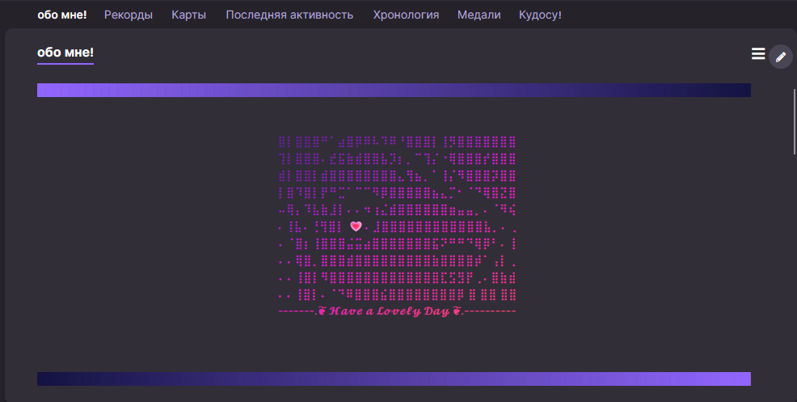

# osu! Gradient Generator

🎨 Create beautiful color gradients for your osu! profile with ease!

---




## 📖 About

osu! Gradient Generator is a web tool that allows you to create stunning text gradients for your osu! profile.

---

## 🎥 Demo Video

https://github.com/user-attachments/assets/63ecdc46-af4a-4f3e-bec9-3b4c722fa0b3

---

### Supported Color Spaces

- **RGB** - Direct interpolation between red, green, and blue values
- **HSL** - Hue, Saturation, Lightness with shortest hue path
- **HSV** - Hue, Saturation, Value interpolation
- **OKLAB** - Perceptually uniform color space (smooth transitions)
- **OKLCH** - Lightness, Chroma, Hue in perceptual space (recommended)

### Interpolation Modes

- **Linear** - Direct linear interpolation
- **Smoothstep** - Ease in/out curve
- **Smootherstep** - Enhanced smooth curve

### Output Format

The tool generates BBCode format compatible with osu! forums:
```
[color=#FF9F1C]T[/color][color=#E86B3C]e[/color][color=#D1435A]x[/color][color=#BA1B77]t[/color]
```

---

## 📝 Local Development

### Run Locally

1. Clone the repository:
```bash
git clone https://github.com/yourusername/osu-gradient.git
cd osu-gradient
```

2. Open `index.html` in your browser

No build process required! It's a single HTML file with embedded CSS and JavaScript.

### Run with Docker

For development or deployment with Docker:

1. Make sure Docker Desktop is running

2. Build and run with Docker Compose:
```bash
docker compose up --build
```

3. Access the application at `http://localhost:7270`

4. To stop the container:
```bash
docker compose down
```

**Docker Setup:**
- Uses lightweight `nginx:alpine` image
- Single HTML file served via nginx
- Port 7270 exposed for local access
- No build dependencies required

---

## 👤 Author

**uniknow**
- [Osu Profile](https://osu.ppy.sh/users/12036908)
- [Twitch](https://www.twitch.tv/uniknow)

---

## 📄 License

This project is open source and available under the [WTFPL](https://www.wtfpl.net/).

---

Made with ❤️ for the osu! community
